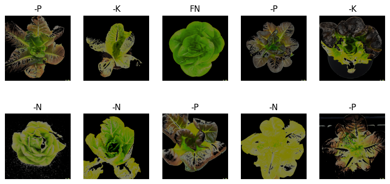
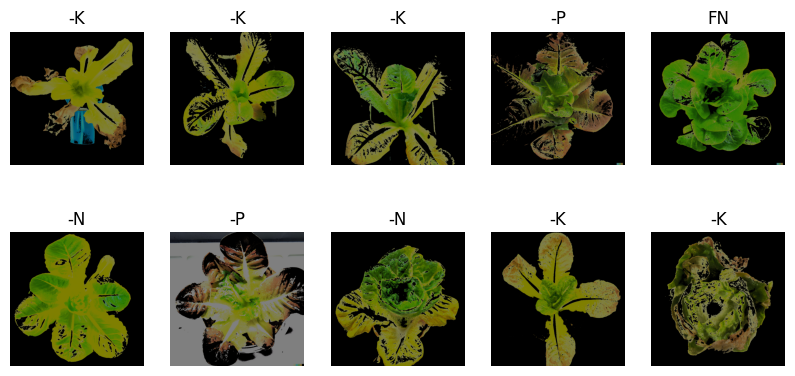
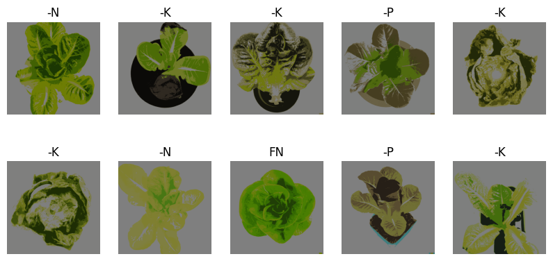
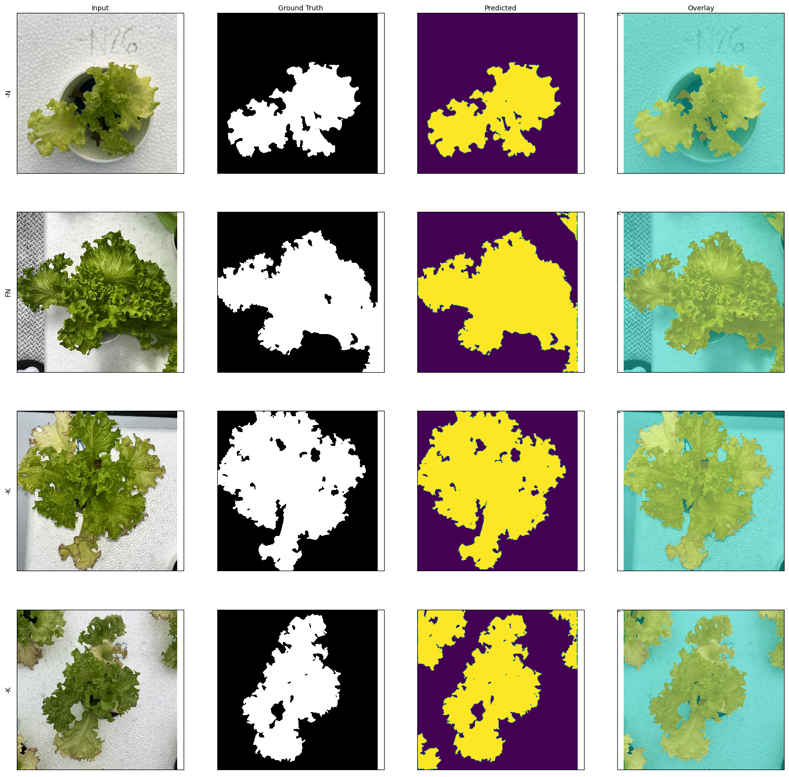

# Mobile-Lettuce-Deficiency-Detector
## Architecture
## Dataset
The dataset used in this project is the [Lettuce-NPK-dataset](https://github.com/ramimalik782/Lettuce-NPK-dataset) by [ramimalik782](https://github.com/ramimalik782).
It contains four folders which are as follows: 
- FN or Full Nutrition (12 images)
- -N (58 images)
- -P (66 images)
- -K (72 images)

Consequently, the group is currently gathering their own lettuce images dataset. 
## Data Preprocessing
TensorFlow tools were used to load and preprocess the images in Jupyter Notebook.
- Data Splitting
- Data Resizing and Normalization
- Data Augmentation
## Image Processing
Traditional and Deep Learning-based methods were tested to segment the lettuce from its background. The traditional methods - Threshold,  Clustering, and Watershed-based techniques - proved to be ineffective in separating the lettuce from the background due to the variations in symptoms manifested by the plant. For instance, for HSV Segmentation to be effective, the parameters have to be set manually by the user. Hence, a deep learning-based method will be implemented on the mobile application. 

### Traditional Image Segmentation Techniques 
Please see the [Data Preprocessing Notebook](Data_Preprocessing.ipynb) for more information. 
#### Otsu Thresholding on HSV Space
A mask was obtained based on the color range set by the user. 

#### Otsu Thresholding on Lab Color Space
Otsu Thresholding on Lab color space, specifically using the logical "or" on *a and *b for better segmentation as per [Yang et al.](https://www.sciencedirect.com/science/article/pii/S2214317321000834).

#### K-means Clustering 
The process of grouping involves minimizing the total distances between each object and the centroid of the group or cluster.

### Deep Learning based Technique 
The segmentation model used is Segnet with VGG16 as the base model. The model for this project was built with the help of [divamgupta's module](https://github.com/divamgupta/image-segmentation-keras/tree/master). This module contains implementation of different segmentation models in Keras. 

## Model Building
## Mobile Application
The mobile application was created using Java in [Android Studio](https://developer.android.com/studio). 
